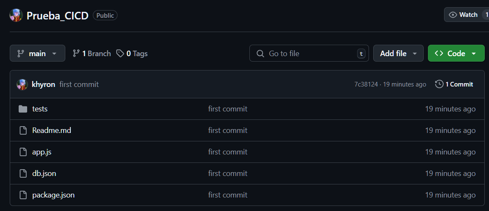
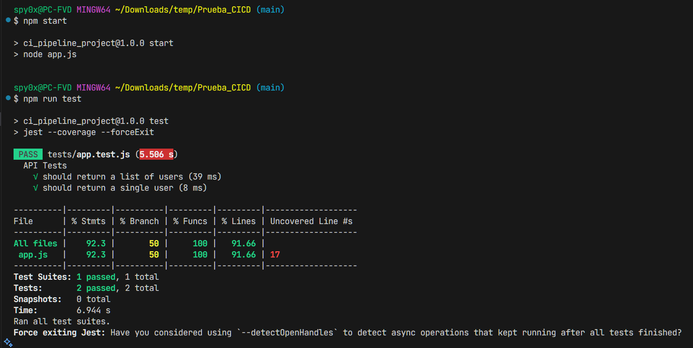
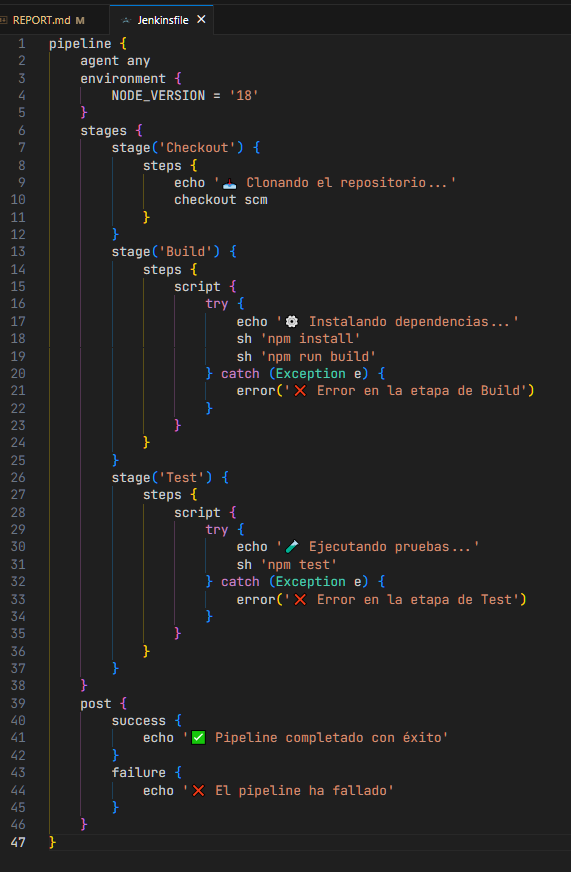
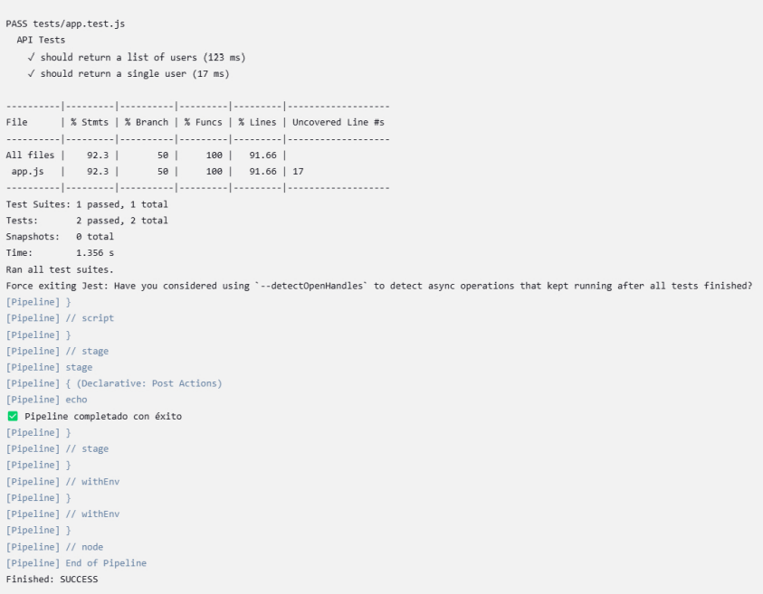
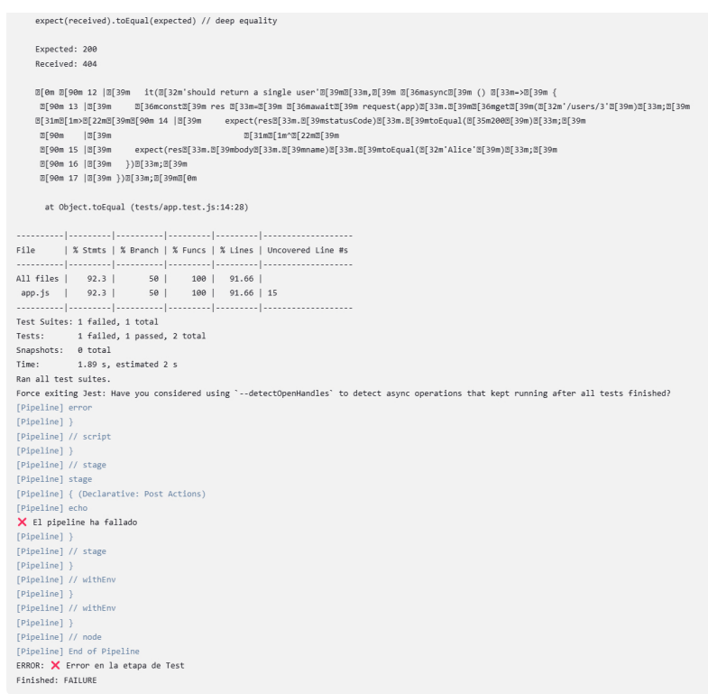

### Participantes:
- Francisco Vargas
- Johann Ortiz
- Luis Cerda

## Problemas Encontrados
- Inexistencia de script npm start: se modificó el package.json para incluir los scripts npm start y build.


#  Configuración inicial del repositorio (2 puntos)
Se verifica la creación exitosa de un repositorio remoto en github cargado con el proyecto local:



#  Configuración básica de la API (2 puntos)
Se demuestra el funcionamiento correcto de la ejecución de los scripts del proyecto ```npm start``` y ```npm run test```



# Automatización básica con Jenkins (3 puntos)
Pipeline de Jenkins que clona el proyecto, instala las dependencias y realiza las pruebas:



Se demuestra que Jenkins ejecuta las instrucciones correctamente:



###### *Se adjunta Reporte_Jenkins_OK.pdf con el Console Output completo en raíz del repositorio.

# Ejecución de pruebas automatizadas

Evidencia de error de tests forzada en Jenkins:




###### *Se adjunta Reporte_Jenkins_KO.pdf con el Console Output completo en raíz del repositorio.